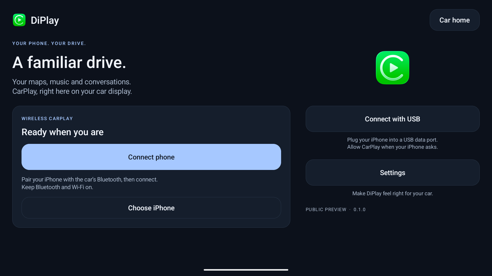

# DiPlay

**CarPlay for compatible BYD Android head units.** Wired and wireless, with the familiar DiAuto interface. Independent app: `com.shihab.diplay`.

> **BYD support scope:** These projects focus on BYD cars. They may work on other brands, but other brands are unsupported and there are no plans to add support or fix brand-specific incompatibilities.

[Download & website](https://shihabal3amri.github.io/DiPlay/) · [Release](https://github.com/shihabal3amri/DiPlay/releases/tag/v0.2.9) · [Report a problem](https://github.com/shihabal3amri/DiPlay/issues/new/choose)

## 0.2.9 — public preview

Install on the **car**, not the iPhone. No jailbreak, dongle, Mac, account or authentication server is required for use. Core CarPlay does not require ADB; optional dashboard, battery, wheel-speed and parked-video features do. Your head unit must permit APK installation. Wireless supports Wi-Fi Direct or the car’s existing hotspot; Wi-Fi Direct requires Android 10+; the APK supports Android 9+ for wired use.

- Wired USB and wireless CarPlay with local authentication.
- BYD HUD navigation with arrows, distance and street names on verified firmware.
- Car hotspot support, improved audio buffering and saved receive diagnostics.
- Automatic address discovery, fixed-channel Wi-Fi fallbacks and successful-configuration memory.
- Icon/text size, resolution and frame rate; applying a display change reconnects CarPlay.
- Local diagnostic export. Reports are sent only if you choose to share them.
- Separate installation alongside DiAuto. Run one projection app at a time.

This is **not an Apple-certified product**. The APK bundles an experimental accessory identity recovered from public Carlinkit firmware, not a newly provisioned MFi identity for DiPlay. A bundled private key is extractable. Acceptance after future iOS updates, reliability across head units and suitability of that identity for general distribution are unresolved. This release invites community testing; it is not a guarantee of universal compatibility.

Earlier releases were tested on the development DiLink5.1 car: live windshield guidance and street names work, Car hotspot now starts CarPlay, and Wi-Fi Direct performance is substantially improved. Occasional audio cutouts remain and are deferred to a later update. The floating-map test build was installed on the development DiLink 5.1 car; feedback led to the pinch corrections in this release. Earlier wheel-speed and video contributions were tested on a BYD Tang with DiLink 5.0 and an iPhone 15 Pro on iOS 27; wheel-speed dead reckoning in tunnels remains unverified. Broader head-unit and iOS compatibility is not guaranteed. The HUD firmware scope and cleanup limits are documented in [BYD navigation](docs/BYD_NAVIGATION.md).

## What’s new in 0.2.9

- Optional floating dashboard map on the centre screen: drag to move, pinch to resize, and tap to open CarPlay. The dashboard keeps its map; permission to draw over other apps is required.
- Smoother map resizing, with no size jump when placing two fingers and immediate resizing away from the minimum or maximum.
- Optional dashboard song title, artist and play/pause status through network ADB.
- CarPlay navigation widget with turn, road, distance, arrival information and song, for launchers that support standard Android widgets.
- Optional live-map embedding for compatible launchers on Android 11+, with developer map-host and DiPlay Home samples. Map sharing is off by default.
- CarPlay follows BYD day/night changes and stays connected through camera resizing during an existing full-screen session. Connecting in a narrow camera window requires one reconnect when it grows.
- Media and navigation audio stream choices 0–20, preserving older saved navigation selections.
- Ukrainian app and website support; GPS no longer reports a northbound course when direction is unknown.

The navigation widget requires a launcher that accepts standard Android widgets; BYD’s built-in home does not accept arbitrary widgets. Floating and embedded maps require **CarPlay map on instrument cluster** to be enabled. The sample apps are developer examples supplied in source. See [release notes](docs/RELEASE-NOTES-0.2.9.md) for details.

## Documentation

- [Install and connect](docs/INSTALL.md)
- [Compatibility and troubleshooting](docs/COMPATIBILITY.md)
- [Privacy and diagnostic reports](docs/PRIVACY.md)
- [Build from source](docs/BUILD.md)
- [Validation](docs/VALIDATION.md)
- [Release notes](CHANGELOG.md)
- [Credits and licenses](docs/THIRD_PARTY_NOTICES.md)

The website is available in English, Arabic, Russian, Ukrainian, Spanish and Simplified Chinese. The app interface supports those same six languages. Choose the app language in Settings; on Android 13+, it stays synchronized with Android’s per-app language setting.

## Source and credits

Based on [xcertplay](https://github.com/shilapi/xcertplay), GPL-3.0. The home/settings UI and website adapt [DiAuto](https://github.com/shihabal3amri/DiAuto), AGPL-3.0; that license is included in `docs/licenses`. Preserve those notices when distributing modifications. CarPlay and its icon belong to Apple Inc.; no Apple or BYD affiliation or endorsement is implied.

This repository starts with a clean public source snapshot. Local research, tester reports and release-signing secrets are excluded. The complete source corresponding to the APK is provided with every release; experimental runtime identity assets are described separately in the build instructions and notices.

## Local release packaging

The release APK intentionally contains the experimental accessory identity. The Git repository and source archive exclude all accessory and Android signing keys; tests generate synthetic identities at runtime. Source/CI builds omit runtime identity assets by default. Local release builds explicitly select an external asset directory. Publishing the APK makes its bundled identity extractable; building locally does not preserve that identity's confidentiality.
